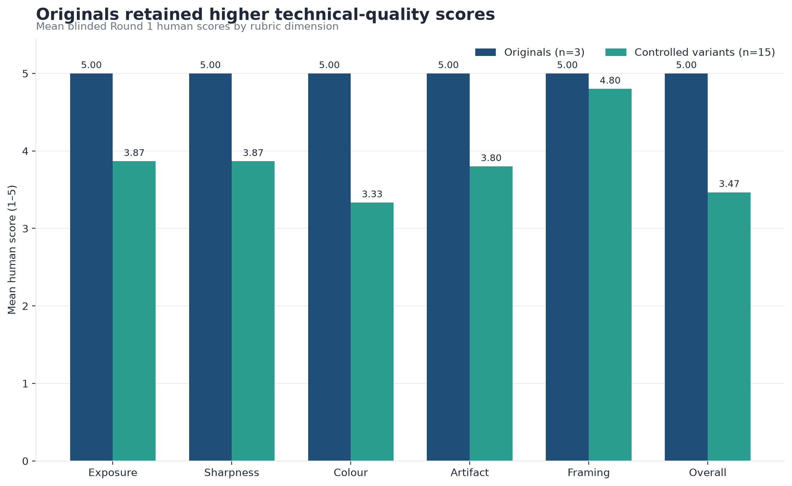
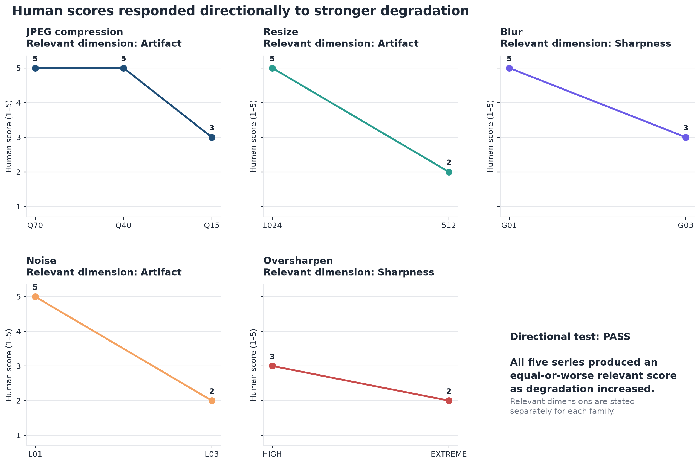
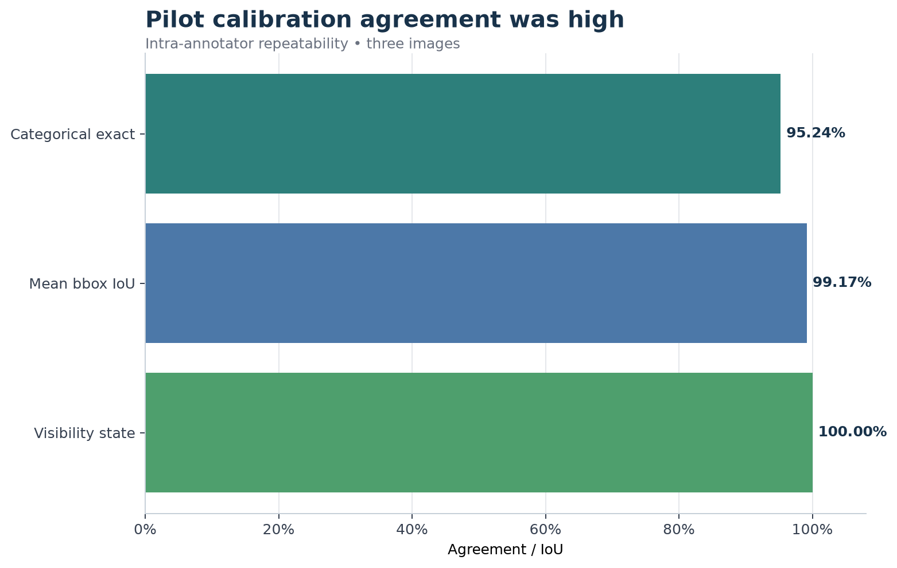
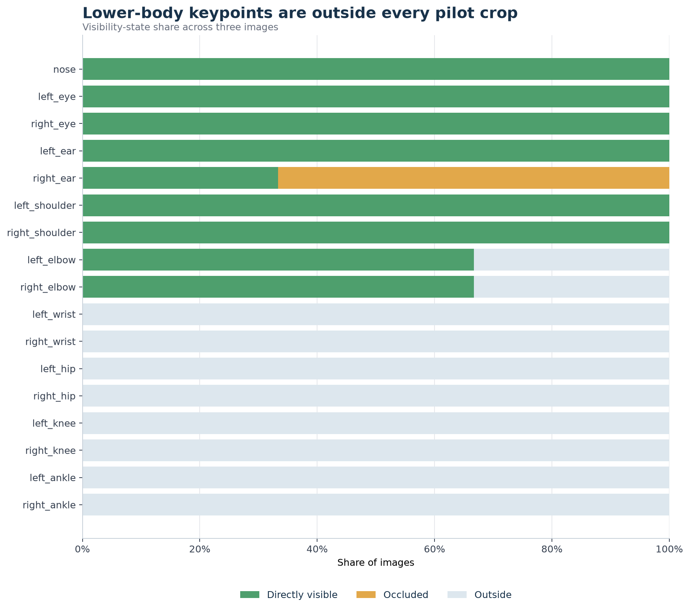

# BODYFRAME 0.5 — Visual Evaluation Lab

**A reproducible pilot workflow for governing, evaluating, annotating, and diagnosing visual datasets.**

BODYFRAME connects image-file QA, controlled technical-quality evaluation,
structured visual annotation, spatial annotation, repeatability analysis,
and dataset coverage diagnostics. Version 0.5 demonstrates that these steps can
share one lineage model and remain auditable from intake through reporting.

> **Pipeline:** Image Intake → Technical Quality QA → Visual Annotation → Spatial Annotation → Reliability Analysis → Dataset Diagnostics

BODYFRAME is an evaluation and data-governance layer for human-centered
computer vision rather than a single-stage pose detector. It records file
provenance, separates automated measurements from human judgement,
distinguishes image-level labels from spatial evidence, preserves
annotation-source authority, measures repeat annotation, and reports where the
dataset remains under-covered.

The public repository reproduces the rules and calculations through Python
modules, schemas, an intake notebook, documentation, aggregate reports, and
validated charts. Original images, raw annotation exports, private registry
rows, and image-dependent annotation tables remain private.

## BODYFRAME 0.5 overview

The governed v0.5 dataset contains **15 registered and annotated originals**
across **11 dataset subject groups**. Its registry holds **15 originals and 20
derivatives (35 assets total)**. The annotation layer contains **15 image-level
records, 15 authoritative manual person boxes, 15 pose-skeleton annotations,
and 255 normalized keypoint records**.

The release combines two deliberately different scopes:

- A three-image architecture pilot used to establish technical-quality,
  annotation, and repeatability workflows.
- A 12-image expansion used to improve categorical and spatial coverage. All
  12 expansion originals passed the established intake pipeline, but they did
  not receive new controlled variants or Round 2 repeat annotation.

This is a small portfolio/research dataset, not a representative population
sample or a benchmark for general model performance.

## Architecture and pipeline

| Component | Responsibility | Publicly reproducible surface |
|---|---|---|
| Image Intake | Registry matching, readability, format, dimensions, metadata, hashes, duplicates, naming, and folder rules | `src/intake_validation.py` and `notebooks/intake_validation.ipynb` |
| Technical Quality QA | Controlled-degradation evidence and blinded human review | Metric functions, methodology, aggregate report, and charts |
| Visual Annotation | Evidence-only camera, framing, orientation, posture, visibility, lighting, and clothing labels | Taxonomy schema and Annotation Manual v1.1 |
| Spatial Annotation | One manual person box and one 17-keypoint pose-skeleton annotation per image | Visibility, bbox, and keypoint normalization functions |
| Reliability Analysis | Repeat-annotation agreement and spatial displacement | Exact agreement, bbox IoU, and keypoint-distance functions |
| Dataset Diagnostics | Categorical diversity and landmark coverage | DataFrame-based coverage functions and aggregate outputs |

The shared data model follows:

`subject → capture session → source image → asset → variant/evaluation`

Identifiers are immutable, and derivatives preserve source and parent lineage.
See [`docs/architecture.md`](docs/architecture.md) and
[`docs/id_and_lineage_rules.md`](docs/id_and_lineage_rules.md).

## Key capabilities

- Reproducible intake checks without making EXIF mandatory.
- Immutable asset lineage across originals, derivatives, reviews, and annotations.
- Controlled image-quality measurements kept separate from human scores.
- A 28-field image-level taxonomy describing visible evidence rather than
  attractiveness, body quality, health, or inferred intent.
- An authoritative manual person box plus a fixed 17-keypoint pose schema.
- Explicit Visible, Occluded, and Outside semantics with COCO interoperability.
- Intra-annotator categorical and spatial repeatability calculations.
- Coverage diagnostics that identify diversity gains and remaining blind spots.

## Technical image-quality evaluation

Stage 2 evaluated **three originals and 15 controlled variants**: JPEG
compression, resizing, Gaussian blur, synthetic noise, exposure changes,
warm/cool colour shifts, and oversharpening. Automated evidence includes image
dimensions, file size, luminance mean and standard deviation, shadow/highlight
clipping, Laplacian variance, and RGB channel means.

These measurements are not converted into automatic quality scores or pass/fail
thresholds. A blinded reviewer independently scored exposure, sharpness,
colour, artifacts, framing, and overall technical quality. The 18 reviews
produced **7 pass, 7 conditional-pass, and 4 fail** decisions. Originals had a
mean overall score of **5.00**, compared with **3.47** for controlled variants.



All tested multi-level degradation series produced an equal-or-worse relevant
human score as severity increased. At the same time, exact expected
primary-defect identification was **6/15 (40%)**, reinforcing an important
design principle: sensitivity to quality loss and correct defect naming are
related but distinct evaluation tasks.



## Annotation system

Image-level labels cover camera/framing, body and head orientation, stance and
visible posture, regional visibility, occlusion, lighting, clothing fit, and
conditional joint states. Left and right always refer to the subject's
anatomical sides. The taxonomy distinguishes:

- `unclear`: visible evidence is insufficient for confident classification;
- `not_visible`: the relevant region cannot be seen;
- `not_applicable`: the field genuinely does not apply.

Each spatial record uses one manual `person_bbox` and one 17-keypoint
`person_pose`. Native CVAT is the canonical raw spatial source; normalized
BODYFRAME tables are canonical for analysis; COCO BBox and COCO Keypoints are
interoperability formats. Directly visible, occluded-but-localizable, and
Outside points map to COCO visibility **2, 1, and 0**. Outside coordinates are
blanked rather than inferred, and pose-derived boxes never replace the manual
person box.

See [`docs/annotation_manual_v1.1.md`](docs/annotation_manual_v1.1.md) and
[`schemas/keypoint_schema.md`](schemas/keypoint_schema.md).

## Calibration and reliability

The original three images were blindly annotated twice by the same annotator.
This measures **intra-annotator repeatability**, not inter-annotator reliability.
Across 84 categorical comparisons, **80 matched exactly (95.24%)**. Mean manual
bbox IoU was **0.9917**; keypoint visibility-state agreement was **100%**; and
the 25 coordinate-comparable keypoints had a mean image-diagonal-normalized
distance of **0.008849**.



Kappa is reported as exploratory and `unstable_small_n`. The calibration uses
only three upper-body-heavy images, one annotator, and no expansion Round 2, so
it does not establish general landmark repeatability or inter-annotator
reliability.

## Dataset diagnostics

The expansion increased categorical fields with more than one observed value
from **5/28 to 27/28**. All 17 landmarks now have nonzero valid-coordinate
coverage. Pooled coordinate coverage reached **76.7% for wrists, 80.0% for
hips, 66.7% for knees, and 60.0% for ankles**.



These diagnostics describe this dataset's composition. They are not pose-model
accuracy, fairness, or population-coverage metrics.

## Repository structure

```text
docs/                 Architecture, methodology, dataset card, and annotation manual
src/                  Intake, quality, normalization, reliability, and coverage modules
notebooks/            Executable Stage 1 intake walkthrough
schemas/              Public-safe registry, taxonomy, and keypoint definitions
reports/              Validated aggregate QA and calibration reports
outputs/charts/        Validated aggregate visualizations
sample_data/           Sample-data policy; no media are currently distributed
```

[`RELEASE_MANIFEST.md`](RELEASE_MANIFEST.md) records the provenance and safety
rationale for every staged file. [`PUBLICATION_AUDIT.md`](PUBLICATION_AUDIT.md)
documents the publication checks.

## Reproducibility and setup

Use Python 3, activate the environment, and then install only the staged code
dependencies.

Windows PowerShell:

```powershell
python -m venv .venv
. .\.venv\Scripts\Activate.ps1
python -m pip install -r requirements.txt
python src/intake_validation.py --help
```

macOS/Linux:

```bash
python3 -m venv .venv
source .venv/bin/activate
python -m pip install -r requirements.txt
python src/intake_validation.py --help
```

The public modules accept explicit paths, values, or DataFrames and do not
silently mutate inputs:

- `technical_quality.quality_metrics`: luminance, clipping, Laplacian, RGB,
  dimensions, and file-size measurements;
- `annotation.normalize_annotations`: manual-box and 17-keypoint normalization;
- `calibration.reliability_metrics`: exact agreement, bbox IoU, and keypoint distances;
- `diagnostics.coverage_diagnostics`: categorical and keypoint coverage summaries.

The algorithms, schemas, notebook structure, reports, and aggregate charts are
reproducible from this repository. A full data-bearing rerun requires separately
authorized registry and image inputs; the sanitized release intentionally does
not include them.

## Privacy and data governance

The public release contains **zero original/private images**. It also excludes
candidate and holdout images, raw CVAT/COCO archives, third-party source
filenames, EXIF/location data, private registry rows, complete image-dependent
annotation tables, local filesystem paths, backups, and credentials.

Publication of sample media remains contingent on redistribution-rights review.
No license or image-redistribution rights are granted unless explicitly stated.

## Limitations

- Fifteen originals across 11 dataset subject groups remain too small for broad generalization.
- One annotator completed the categorical and spatial annotations.
- Stage 2 controlled variants and human technical reviews cover only the original three images.
- Repeatability covers only three upper-body-heavy pilot images; expansion
  repeatability and inter-annotator reliability are unmeasured.
- Version 0.5 pose keypoints are manually annotated; automated pose estimation
  and temporal tracking belong to future stages.
- Lower-body landmarks have partial rather than universal coordinate coverage.
- Single-leg support is not explicitly encoded by the taxonomy.
- BODYFRAME 0.5 does not support medical, biometric, attractiveness,
  body-rating, fairness, or general pose-model performance claims.

## Roadmap / next technical phase

### Stage 6 — Video Architecture

The next technical phase extends the governed evaluation architecture from
still images to video. Stage 6 is architectural work; v0.5 does not yet claim
video processing or temporal results.

### Stage 7 — Pose Tracking Engine (planned)

Pose tracking is planned after the video architecture is defined. Automated
pose estimation and temporal tracking are not v0.5 capabilities.

### Publication follow-up

- Select and review code and documentation licenses.
- Add only redistribution-approved public samples and matching regression fixtures.
- Expand coverage across subjects, sessions, framing, and pose strata.
- Run multi-annotator calibration and repeat annotation on a larger, more varied set.

BODYFRAME 0.5 therefore serves as a transparent systems-and-evaluation pilot:
the architecture is connected and reproducible, while its evidence boundaries
remain explicit.
